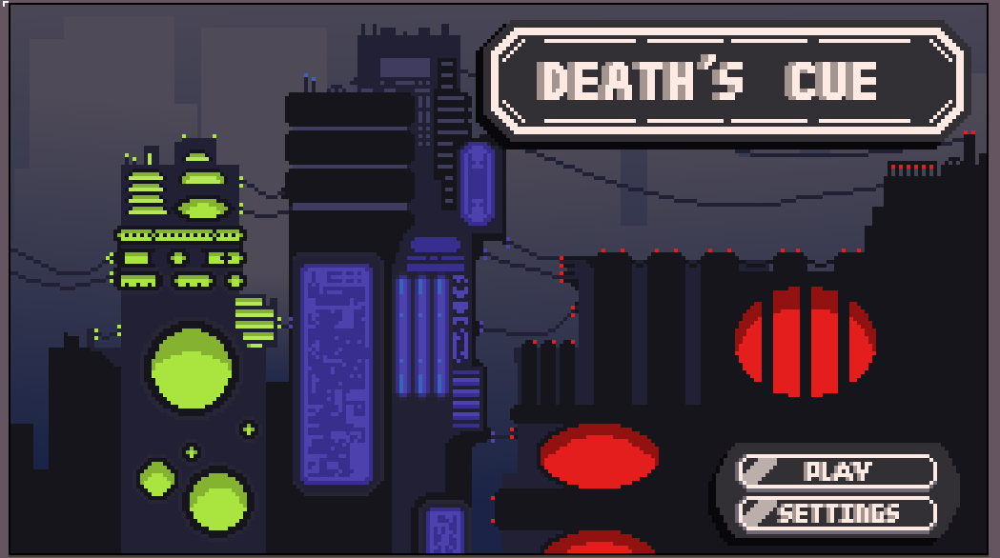
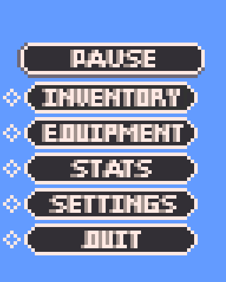

# Death's Cue

### 2D Top-Down Action RPG | Unity | C#

**Death's Cue** is a collaborative 2D top-down action RPG developed as a college software development project using **Unity and C#**.

The project combines gameplay systems, visual design, animations, user-interface elements, and interactive game mechanics into a complete playable experience.

---

## 🎮 Project Showcase

### Main Menu

The main menu features the game's visual style along with interactive **Play** and **Settings** buttons.

### Health Icons

Several health icon concepts were developed before the team selected the mask design used in the final game.

### Pause Menu

The pause menu provides access to the player's **inventory, equipment, stats, settings, and other gameplay options**.

---

## 👨‍💻 My Contributions

My primary responsibilities focused on the game's **artwork and visual presentation**, along with implementing interactive UI and gameplay effects.

### Artwork & Visual Design

* Created artwork and visual assets used throughout the game.
* Designed multiple visual concepts for game UI elements, including health icons.
* Integrated artwork into the game's Unity environment.

### UI & Menu Systems

* Implemented functionality for the main menu's **Play** and **Settings** buttons.
* Worked on UI transitions between different game screens.
* Contributed to the pause menu interface and its integration with gameplay systems.

### Animation & Gameplay Effects

* Created and implemented the player's **death animation**.
* Implemented visual effects associated with weapons.
* Connected visual effects and animations to gameplay events.

---

## 🛠️ Technologies & Tools

* **Unity**
* **C#**
* **Git / GitHub**
* **Unity Input System**
* Pixel-art based visual design

---

## 👥 Team Project

Death's Cue was developed collaboratively as a college software development project.

**Team Members**

* Jerred Carter
* Justin White
* Jacob Davidson

My role focused primarily on artwork, visual design, UI implementation, animations, and gameplay effects.

---

## 📚 What I Learned

Working on Death's Cue provided experience with developing a larger software project in a collaborative environment.

Through the project, I gained experience with:

* Working within an existing software architecture
* Integrating visual assets into a functional application
* Implementing UI interactions and screen transitions
* Connecting animations and visual effects to gameplay
* Collaborating with other developers through version control
* Iterating on visual designs based on project requirements

---

## 🎥 Project Status

This repository showcases the development work and assets from the college project. It is primarily intended as a **portfolio and demonstration of my contributions** to the project.
